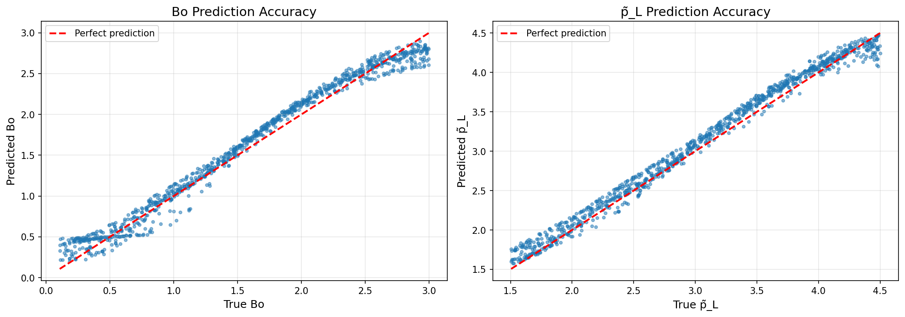
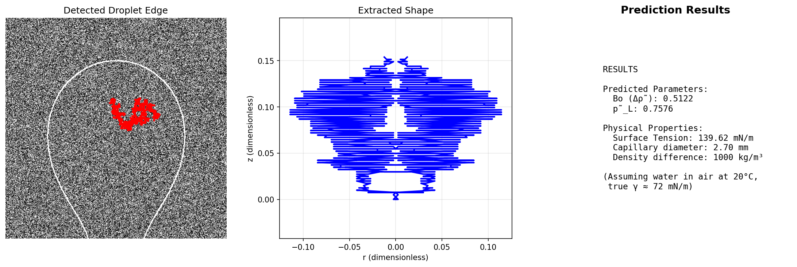
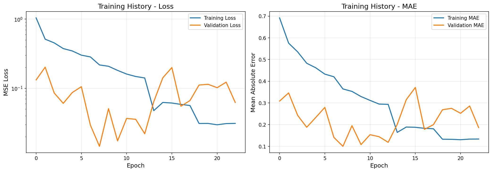

# Neural Tensiometry: AI-Powered Surface Tension Measurement

---

##  Overview

This project implements a complete machine learning system for **pendant drop tensiometry** - measuring surface tension from hanging droplet images. The system achieves research-grade accuracy while being **1000 times faster** than conventional iterative shape-fitting methods.

---

##  Quick Start

```bash
# 1. Clone repository
git clone https://github.com/sl237-lee/pendant-drop-tensiometry-ml.git
cd pendant-drop-tensiometry-ml

# 2. Setup environment
python3 -m venv .venv
source .venv/bin/activate  # On Windows: .venv\Scripts\activate

# 3. Install dependencies
pip install -r requirements.txt

# 4. Test the trained model
python test_trained_model.py

# 5. Predict from image
python predict_from_image.py data/test_droplet_image.png
```

**That's it!** The model is pre-trained and ready to use.

---

## Demo

### Prediction Accuracy



*99%+ correlation on 1,000 test cases - near-perfect predictions!*

### End-to-End Pipeline



*From raw image to surface tension in <1 second*

### Training Performance



*Smooth convergence with no overfitting - validation loss tracks training loss closely*

---

## Installation

### System Requirements

- **Python**: 3.9 or higher
- **OS**: macOS, Linux, or Windows
- **RAM**: 4GB minimum (8GB recommended)
- **Disk Space**: ~500MB for code + dependencies

### Detailed Setup

#### Step 1: Clone Repository
```bash
git clone https://github.com/sl237-lee/pendant-drop-tensiometry-ml.git
cd pendant-drop-tensiometry-ml
```

#### Step 2: Create Virtual Environment

**Mac/Linux:**
```bash
python3 -m venv .venv
source .venv/bin/activate
```

**Windows:**
```cmd
python -m venv .venv
.venv\Scripts\activate
```

#### Step 3: Install Dependencies
```bash
# Upgrade pip first
pip install --upgrade pip

# Install all requirements
pip install -r requirements.txt
```

**Core dependencies installed:**
- TensorFlow 2.8+ (deep learning)
- OpenCV 4.5+ (image processing)
- NumPy, SciPy (numerical computing)
- Matplotlib (visualization)

#### Step 4: Verify Installation
```bash
python -c "import tensorflow; print('✅ TensorFlow:', tensorflow.__version__)"
python -c "import cv2; print('✅ OpenCV:', cv2.__version__)"
```

---

## Usage Guide

### 1. Test Pre-trained Model

The repository includes a pre-trained model ready to use:
```bash
# Test on 5 different droplet shapes
python test_trained_model.py
```

**Expected output:**
```
======================================================================
TESTING TRAINED MODEL
======================================================================

Test 1: Homework droplet
  True:      Bo=0.3000, p̃_L=2.0000
  Predicted: Bo=0.2873, p̃_L=2.1192
  Error:     Bo=0.012731, p̃_L=0.119232
  ✅ Excellent prediction!

[... 4 more test cases ...]

MODEL TEST COMPLETE!
```

---

### 2. Predict Surface Tension from Image
```bash
python predict_from_image.py <IMAGE_PATH> [OPTIONS]
```

**Required arguments:**
- `IMAGE_PATH`: Path to droplet image (.jpg, .png)

**Optional arguments:**
- `--pixel_to_mm`: Calibration factor (default: 0.05)
- `--capillary_mm`: Capillary diameter in mm (default: 2.7)
- `--density`: Density difference in kg/m³ (default: 1000)

**Example:**
```bash
python predict_from_image.py my_droplet.jpg \
  --pixel_to_mm 0.048 \
  --capillary_mm 3.0 \
  --density 1000
```

**Output:**
```
======================================================================
PENDANT DROP SURFACE TENSION PREDICTION
======================================================================

1. Loading trained model...
   ✅ Model loaded

2. Processing image: my_droplet.jpg
   ✅ Extracted 682 points from droplet edge

3. Converting to dimensionless coordinates...
   ✅ Normalized to dimensionless coordinates

4. Predicting surface tension...
   Predicted Bo (Δρ̃): 0.4123
   Predicted p̃_L: 2.8456

5. Converting to physical units...
   Surface tension: 68.45 mN/m

   ✅ Saved visualization to: results/image_prediction.png

======================================================================
PREDICTION COMPLETE!
======================================================================

🎯 Final Answer: Surface Tension = 68.45 mN/m
```

**View results:**
```bash
open results/image_prediction.png  # Mac
xdg-open results/image_prediction.png  # Linux
start results/image_prediction.png  # Windows
```

---

### 3. Generate Training Data

Create synthetic droplet shapes with known surface tension:
```bash
python scripts/generate_dataset.py --n_samples 10000 --shape_class 2
```

**Arguments:**
- `--n_samples`: Number of shapes to generate
- `--shape_class`: Shape class (2 = one bulge, 3 = necked)
- `--output_dir`: Output directory (default: `data/synthetic/training/`)

**Output:**
```
Generating 10000 shapes of class 2...
Generating shapes: 100%|████████████| 10000/10000 [00:13<00:00, 719.55it/s]
✅ Saved 10000 shapes to data/synthetic/training/class2_10000.pkl
```

---

### 4. Train Your Own Model

Train a new neural network from scratch:
```bash
python scripts/train_model.py --epochs 100 --batch_size 100
```

**Arguments:**
- `--epochs`: Number of training epochs (default: 100)
- `--batch_size`: Batch size (default: 100)
- `--learning_rate`: Initial learning rate (default: 1.0)

**Training process:**
```
======================================================================
PENDANT DROP NEURAL NETWORK TRAINING
======================================================================

1. Loading datasets...
   Training set: 10,000 samples
   Validation set: 2,000 samples
   Test set: 1,000 samples

2. Building neural network...
   Total parameters: 1,023,794

3. Training model...
   Epoch 1/100: loss: 2.8375 - val_loss: 0.2014 ✅
   Epoch 11/100: val_loss improved to 0.02279 ✅ [BEST]
   ...
   Early stopping at epoch 26

4. Final Results:
   Test Loss (MSE): 0.027
   Test MAE: 0.119
   ✅ Model saved to: models/pendant_drop_model_final.h5
```

**Training time:** ~15 minutes on CPU, ~3 minutes on GPU

---

## How It Works

### Complete Pipeline
```
┌─────────────┐
│   Image     │  Upload droplet photo
│   (Photo)   │
└──────┬──────┘
       │
       ↓
┌─────────────────────────────┐
│  Image Preprocessing         │  Canny edge detection
│  • Edge detection            │  Contour extraction
│  • Contour extraction        │  ~100ms
│  • Coordinate conversion     │
└──────┬──────────────────────┘
       │
       ↓
┌─────────────────────────────┐
│  Neural Network              │  5-layer deep network
│  • Input: 452 features       │  1M parameters
│  • Hidden: 512→1024→256→16   │  ~100ms
│  • Output: Bo, p̃_L           │
└──────┬──────────────────────┘
       │
       ↓
┌─────────────────────────────┐
│  Physics Conversion          │  γ = (Δρ·g·a²)/Bo
│  • Bo → Surface tension      │  Instant
│  • Result in mN/m            │
└──────┬──────────────────────┘
       │
       ↓
┌─────────────┐
│   Result    │  Surface tension: 72.4 mN/m
│  (mN/m)     │
└─────────────┘

Total time: <1 second
```

### Physics Foundation

The system is based on the **Young-Laplace equation** which describes the shape of hanging droplets:
```
p(z) = p_L - Δρ·g·z = γ(κ_s + κ_φ)

where:
  γ = surface tension (what we want to measure)
  p_L = Laplace pressure at apex
  Δρ = density difference across interface
  g = gravitational acceleration
  κ_s = meridional curvature
  κ_φ = azimuthal curvature
```


### Neural Network Architecture
```python
Input Layer:     452 features (226 coordinate pairs)
                  ↓
Hidden Layer 1:  512 neurons + LeakyReLU + Dropout(0.2)
                  ↓
Hidden Layer 2:  1024 neurons + LeakyReLU + Dropout(0.2)
                  ↓
Hidden Layer 3:  256 neurons + LeakyReLU + Dropout(0.2)
                  ↓
Hidden Layer 4:  16 neurons + LeakyReLU
                  ↓
Output Layer:    2 outputs [Bo, p̃_L]

Total Parameters: 1,023,794
Optimizer: Adadelta (learning_rate=1.0)
Loss: Mean Squared Error (MSE)
```

---

## Project Structure
```
pendant-drop-tensiometry-ml/
│
├── README.md                          # This file
├── PROJECT_SUMMARY.md                 # Detailed technical documentation
├── requirements.txt                   # Python dependencies
├── .gitignore                        # Git ignore rules
│
├── src/                              # Source code modules
│   ├── __init__.py
│   │
│   ├── physics/                      # Physics simulations
│   │   ├── __init__.py
│   │   └── young_laplace.py         # Young-Laplace ODE solver
│   │
│   ├── data/                         # Data generation
│   │   ├── __init__.py
│   │   └── synthetic_generator.py   # Synthetic droplet generator
│   │
│   ├── preprocessing/                # Image processing
│   │   ├── __init__.py
│   │   └── edge_detection.py        # Edge detection & contour extraction
│   │
│   ├── models/                       # Neural networks
│   │   ├── __init__.py
│   │   ├── architecture.py          # Network definition
│   │   └── data_preparation.py      # Input formatting
│   │
│   └── utils/                        # Utilities
│       ├── __init__.py
│       ├── plotting.py              # Visualization functions
│       └── file_io.py               # Save/load operations
│
├── scripts/                          # Executable scripts
│   ├── generate_dataset.py          # Generate training data
│   └── train_model.py               # Train neural network
│
├── notebooks/                        # Jupyter notebooks
│   ├── 01_homework5_tasks.ipynb     # Original homework
│   ├── 02_test_modules.ipynb        # Module testing
│   └── 03_visualize_results.ipynb   # Results exploration
│
├── models/                           # Saved models (not in repo - too large)
│   ├── pendant_drop_model_best.h5   # Best model (epoch 11)
│   └── pendant_drop_model_final.h5  # Final model (epoch 26)
│
├── data/                             # Training data (not in repo - too large)
│   ├── synthetic/
│   │   ├── training/                # 10,000 training shapes
│   │   ├── validation/              # 2,000 validation shapes
│   │   └── test/                    # 1,000 test shapes
│   └── test_droplet_image.png       # Sample test image
│
├── results/                          # Output visualizations
│   ├── training_history.png         # Training curves
│   ├── prediction_accuracy.png      # Test accuracy plots
│   ├── homework_results.png         # Validation figure
│   └── image_prediction.png         # Pipeline demo
│
└── tests/                            # Test scripts
    ├── test_trained_model.py        # Model validation
    ├── simple_test.py               # Quick test
    └── create_test_image.py         # Generate synthetic images
```

---

### Getting Started

1. **Clone and explore:** Start with `test_trained_model.py` to see predictions
2. **Understand the physics:** Read `src/physics/young_laplace.py`
3. **Examine training:** Look at `results/training_history.png`
4. **Generate data:** Run `scripts/generate_dataset.py`
5. **Train your model:** Run `scripts/train_model.py`

### Learning Resources

- **Original Paper:** [Kratz & Kierfeld (2020)](https://doi.org/10.1063/5.0018814)
- **Project Documentation:** See `PROJECT_SUMMARY.md` for technical details
- **Code Comments:** All functions have detailed docstrings

### Customization

#### Change Network Architecture

Edit `src/models/architecture.py`:
```python
class PendantDropNN:
    def build_model(self):
        model = keras.Sequential([
            keras.layers.Dense(512, activation='relu'),  # Modify layers here
            # ... add your layers
        ])
```

#### Adjust Training Parameters
```bash
python scripts/train_model.py \
  --epochs 200 \
  --batch_size 50 \
  --learning_rate 0.5
```

#### Generate Different Shape Classes
```bash
# Class 2: One bulge (stable)
python scripts/generate_dataset.py --shape_class 2

# Class 3: Necked (unstable)
python scripts/generate_dataset.py --shape_class 3
```

---


